# 04 — UML Design

Contents: class diagram (domain model), sequence diagrams (nominal and alternative scenarios), state machines, activity diagram of the global process, and the planning rules.

## 1. Class diagram (domain model)

This model is the **single source** for the NoSQL schema ([05](05-nosql-schema.md)). Every rule in the transformation section refers to the associations shown here.

```mermaid
classDiagram
    direction LR

    class User {
        +String id
        +String email
        +String passwordHash
        +String firstName
        +String lastName
        +String phone
        +Set~Role~ roles
        +boolean enabled
        +boolean onboardingDone
        +boolean mustChangePassword
        +FarmerProfile farmerProfile
        +String assignedMillId
        +Instant createdAt
        +String createdBy
        +Instant lastModifiedAt
        +String lastModifiedBy
        +Long version
    }
    class FarmerProfile {
        +String memberNumber
        +String cin
        +String address
        +Delegation delegation
    }
    class RegistrationRequest {
        +String id
        +String firstName
        +String lastName
        +String email
        +String phone
        +String cin
        +String message
        +RegistrationStatus status
        +Instant createdAt
        +String processedById
        +String createdUserId
    }
    class RegistrationStatus {
        <<enumeration>>
        PENDING
        APPROVED
        REJECTED
    }
    class Role {
        <<enumeration>>
        FARMER
        COLLECTION_MANAGER
        TEAM_LEADER
        LOGISTICS_MANAGER
        MILL_MANAGER
        ADMIN
    }
    class Delegation {
        <<enumeration>>
        SFAX_VILLE
        SFAX_OUEST
        SFAX_SUD
        SAKIET_EZZIT
        SAKIET_EDDAIER
        THYNA
        AGAREB
        JEBINIANA
        EL_AMRA
        EL_HENCHA
        MENZEL_CHAKER
        GHRAIBA
        BIR_ALI_BEN_KHALIFA
        SKHIRA
        MAHRES
        KERKENNAH
    }

    class Orchard {
        +String id
        +String name
        +String ownerId
        +Map~String,String~ owner
        +GeoPoint location
        +GeoPolygon boundary
        +List~Plot~ plots
        +double areaHa
        +String delegation
        +int treeCount
        +String mainVarietyCode
        +HarvestStatus harvestStatus
        +double currentMaturityIndex
        +Instant maturityUpdatedAt
        +double lastSeasonYieldKgHa
        +Long version
        +recomputeTotals()
    }
    class GeoPoint {
        +String type
        +List~Double~ coordinates
    }
    class Plot {
        +String code
        +String varietyCode
        +double areaHa
        +int treeCount
        +int plantingYear
        +boolean irrigated
    }
    class OliveVariety {
        +String code
        +String name
        +double avgOilYieldPct
        +double optimalMaturityMin
        +double optimalMaturityMax
    }
    class HarvestStatus {
        <<enumeration>>
        NOT_HARVESTED
        SCHEDULED
        IN_PROGRESS
        HARVESTED
    }

    class HarvestRequest {
        +String id
        +HarvestType type
        +LocalDate desiredFrom
        +LocalDate desiredTo
        +double estimatedQuantityKg
        +String comment
        +HarvestRequestStatus status
        +String rejectionReason
        +double priorityScore
        +Instant createdAt
        +Instant validatedAt
        +long version
        +canBeModifiedBy(User) boolean
        +transitionTo(status, User)
    }
    class HarvestType {
        <<enumeration>>
        PLANNED
        URGENT
    }
    class HarvestRequestStatus {
        <<enumeration>>
        SUBMITTED
        VALIDATED
        REJECTED
        SCHEDULED
        IN_PROGRESS
        COMPLETED
        CANCELLED
    }
    class StatusChange {
        +String from
        +String to
        +Instant at
        +String byUserId
        +String comment
    }

    class CollectionRound {
        +String id
        +String code
        +LocalDate date
        +LocalTime startTime
        +LocalTime endTime
        +RoundStatus status
        +double totalHarvestedKg
        +Instant startedAt
        +Instant completedAt
        +long version
        +start()
        +complete()
    }
    class RoundStop {
        +int order
        +String orchardName
        +GeoPoint location
        +LocalTime plannedArrival
        +StopStatus status
        +double harvestedKg
        +int crateCount
        +String comment
    }
    class RoundStatus {
        <<enumeration>>
        PLANNED
        IN_PROGRESS
        COMPLETED
        CANCELLED
    }

    class Worker {
        +String id
        +String firstName
        +String lastName
        +String cin
        +String phone
        +Set~String~ skills
        +double dailyRate
        +boolean active
        +List~Unavailability~ unavailabilities
    }
    class Equipment {
        <<abstract>>
        +String id
        +String code
        +EquipmentType type
        +EquipmentStatus status
        +List~Unavailability~ unavailabilities
    }
    class Tractor {
        +String plateNumber
        +int powerHp
    }
    class Bin {
        +String serialNumber
        +double capacityKg
    }
    class Tool {
        +ToolType toolType
        +int stockQuantity
    }
    class Unavailability {
        +Instant from
        +Instant to
        +String reason
    }
    class EquipmentType {
        <<enumeration>>
        TRACTOR
        BIN
        NET
        SHAKER
    }
    class EquipmentStatus {
        <<enumeration>>
        AVAILABLE
        MAINTENANCE
        OUT_OF_ORDER
    }
    class ToolType {
        <<enumeration>>
        NET
        SHAKER
    }
    class ResourceBooking {
        +String id
        +ResourceKind resourceKind
        +Instant start
        +Instant end
        +BookingStatus status
    }
    class SupplyOrder {
        +String id
        +int quantity
        +String supplier
        +LocalDate orderedAt
        +LocalDate expectedAt
        +LocalDate receivedAt
        +SupplyStatus status
        +receive()
    }

    class Mill {
        +String id
        +String name
        +GeoPoint location
        +String address
        +double dailyCapacityKg
        +double availableCapacityKg
        +Instant capacityUpdatedAt
    }
    class MillReception {
        +String id
        +double grossWeightKg
        +double tareKg
        +double netWeightKg
        +double binCapacityKg
        +double fillRate
        +Instant receivedAt
        +String season
        +computeNetAndFillRate()
    }
    class QualityAssessment {
        +QualityGrade grade
        +double defectRatePct
        +double leafRatePct
        +double estimatedOilYieldPct
    }

    class FieldAlert {
        +String id
        +AlertType type
        +AlertSeverity severity
        +AlertStatus status
        +AlertSource source
        +GeoPoint location
        +String description
        +List~String~ photoUrls
        +String resolution
        +Instant createdAt
    }

    class WeatherReading {
        +Instant timestamp
        +String stationId
        +String delegation
        +double temperatureC
        +double humidityPct
        +double rainfallMm
        +double windKmh
    }
    class MaturityReading {
        +Instant timestamp
        +double maturityIndex
        +ReadingSource source
    }

    class Notification {
        +String id
        +NotificationType type
        +String title
        +String message
        +String link
        +boolean read
        +Instant createdAt
    }
    class ImportJob {
        +String id
        +ImportSource source
        +String dataset
        +String fileName
        +String checksum
        +ImportStatus status
        +int totalRows
        +int insertedRows
        +int updatedRows
        +int rejectedRows
        +Instant startedAt
        +Instant finishedAt
    }
    class ImportError {
        +int line
        +String field
        +String reason
    }

    %% ---- relationships ----
    User "1" *-- "0..1" FarmerProfile : farmer data
    User "1" --> "*" Role
    FarmerProfile "*" --> "1" Delegation
    RegistrationRequest "*" --> "0..1" User : processed by
    User "1" --> "0..*" Orchard : owns
    Orchard "1" *-- "1..*" Plot
    Plot "*" --> "1" OliveVariety
    Orchard --> HarvestStatus

    User "1" --> "0..*" HarvestRequest : declares
    HarvestRequest "*" --> "1" Orchard : concerns
    HarvestRequest "1" *-- "*" StatusChange : history
    HarvestRequest --> HarvestType
    HarvestRequest --> HarvestRequestStatus

    CollectionRound "1" *-- "1..*" RoundStop : stops
    RoundStop "*" --> "1" HarvestRequest : serves
    RoundStop "*" --> "1" Orchard : visits
    CollectionRound "*" --> "1" User : team leader
    CollectionRound "*" --> "1" User : planned by
    CollectionRound "*" --> "1" Mill : delivers to
    CollectionRound "*" --> "*" Worker : team
    CollectionRound "*" --> "*" Equipment : uses
    CollectionRound "1" *-- "*" StatusChange : history
    CollectionRound --> RoundStatus

    Equipment <|-- Tractor
    Equipment <|-- Bin
    Equipment <|-- Tool
    Worker "1" *-- "*" Unavailability
    Equipment "1" *-- "*" Unavailability
    ResourceBooking "*" --> "1" CollectionRound : for
    ResourceBooking "*" --> "0..1" Worker : books
    ResourceBooking "*" --> "0..1" Equipment : books
    SupplyOrder "*" --> "1" Tool : replenishes

    Mill "*" --> "*" User : managed by
    MillReception "*" --> "1" Mill
    MillReception "*" --> "1" CollectionRound
    MillReception "*" --> "1" Bin
    MillReception "*" --> "1" Orchard
    MillReception "*" --> "1" HarvestRequest
    MillReception "1" *-- "1" QualityAssessment

    FieldAlert "*" --> "1" Orchard : about
    FieldAlert "*" --> "0..1" User : reported by
    FieldAlert "*" --> "0..1" User : handled by
    FieldAlert "*" --> "0..1" HarvestRequest : led to
    FieldAlert "1" *-- "*" StatusChange : history

    WeatherReading "*" --> "0..1" Orchard : near
    MaturityReading "*" --> "1" Orchard : measures

    Notification "*" --> "1" User : recipient
    ImportJob "1" *-- "*" ImportError
```

> **For the report:** this full diagram is dense once rendered. Keep it as an appendix, and in the body show three focused views made by copying the relevant classes: (1) users, orchards and harvest requests; (2) rounds, resources and bookings; (3) mill, alerts and telemetry.

### Notes on modelling choices

- **User + roles rather than one subclass per actor.** A person can hold several roles (for example, an admin who is also collection manager). Farmer-specific data lives in an optional `FarmerProfile` composition. The inheritance example the report needs is `Equipment ← Tractor/Bin/Tool`.
- **`HarvestRequest` is separate from `CollectionRound`.** A request belongs to the farmer and has its own lifecycle. A round groups several requests, one `RoundStop` per request.
- **`ResourceBooking` is a class of its own, not just a list of ids.** The calendar per resource (F3) and conflict detection need efficient queries such as "bookings of resource X between t1 and t2".
- **`MillReception` is one weighing of one bin carrying one farmer's olives from one orchard.** This keeps traceability for paying the farmer, and gives the dashboard yield per orchard directly.
- **Time-series classes** (`WeatherReading`, `MaturityReading`) have unbounded growth, and are the "massive data" of the subject.

## 2. Sequence diagrams

### SD-1 Authentication (nominal + alternatives)

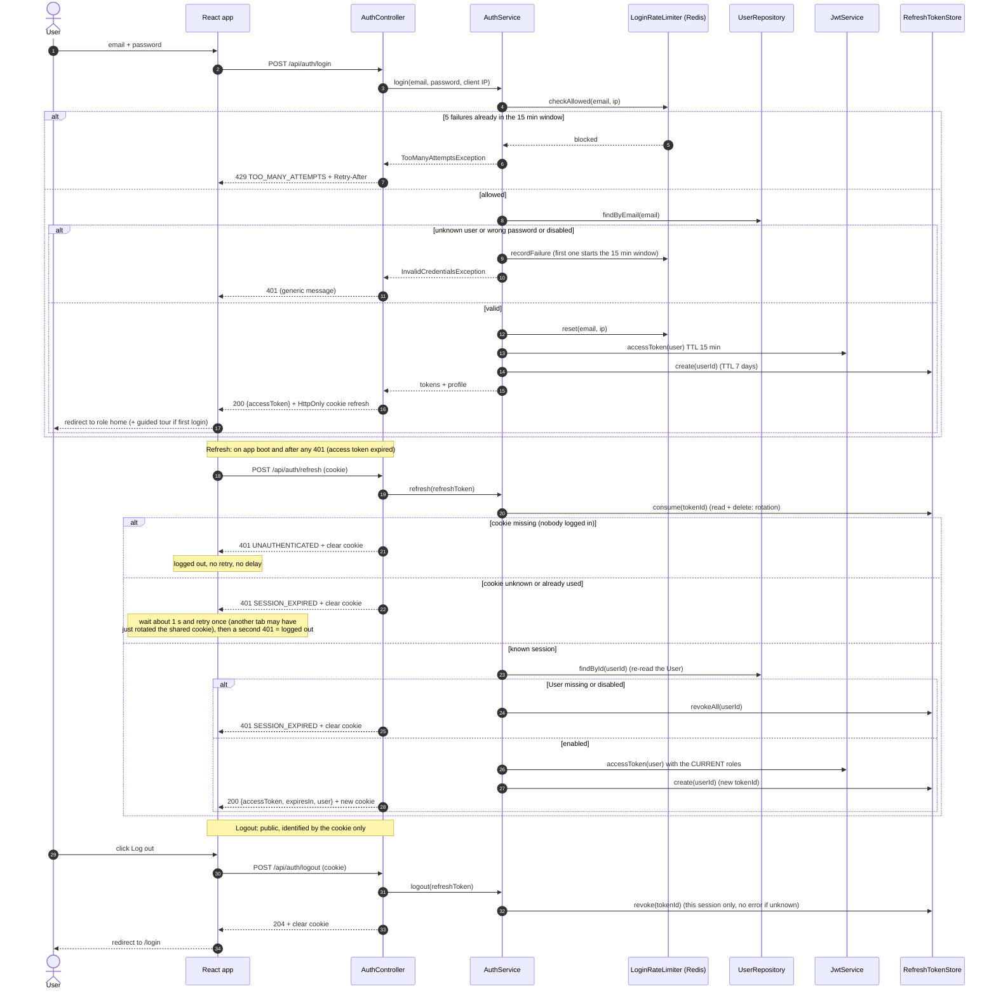
```mermaid
sequenceDiagram
    autonumber
    actor U as User
    participant FE as React app
    participant AC as AuthController
    participant AS as AuthService
    participant RL as LoginRateLimiter (Redis)
    participant UR as UserRepository
    participant JS as JwtService
    participant RT as RefreshTokenStore

    U->>FE: email + password
    FE->>AC: POST /api/auth/login
    AC->>AS: login(email, password, client IP)
    AS->>RL: checkAllowed(email, ip)
    alt 5 failures already in the 15 min window
        RL-->>AS: blocked
        AS-->>AC: TooManyAttemptsException
        AC-->>FE: 429 TOO_MANY_ATTEMPTS + Retry-After
    else allowed
        AS->>UR: findByEmail(email)
        alt unknown user or wrong password or disabled
            AS->>RL: recordFailure (first one starts the 15 min window)
            AS-->>AC: InvalidCredentialsException
            AC-->>FE: 401 (generic message)
        else valid
            AS->>RL: reset(email, ip)
            AS->>JS: accessToken(user) TTL 15 min
            AS->>RT: create(userId) (TTL 7 days)
            AS-->>AC: tokens + profile
            AC-->>FE: 200 {accessToken} + HttpOnly cookie refresh
            FE-->>U: redirect to role home (+ guided tour if first login)
        end
    end

    Note over FE,AC: Refresh: on app boot and after any 401 (access token expired)
    FE->>AC: POST /api/auth/refresh (cookie)
    AC->>AS: refresh(refreshToken)
    AS->>RT: consume(tokenId) (read + delete: rotation)
    alt cookie missing (nobody logged in)
        AC-->>FE: 401 UNAUTHENTICATED + clear cookie
        Note over FE: logged out, no retry, no delay
    else cookie unknown or already used
        AC-->>FE: 401 SESSION_EXPIRED + clear cookie
        Note over FE: wait about 1 s and retry once (another tab may have<br/>just rotated the shared cookie), then a second 401 = logged out
    else known session
        AS->>UR: findById(userId) (re-read the User)
        alt User missing or disabled
            AS->>RT: revokeAll(userId)
            AC-->>FE: 401 SESSION_EXPIRED + clear cookie
        else enabled
            AS->>JS: accessToken(user) with the CURRENT roles
            AS->>RT: create(userId) (new tokenId)
            AC-->>FE: 200 {accessToken, expiresIn, user} + new cookie
        end
    end

    Note over FE,AC: Logout: public, identified by the cookie only
    U->>FE: click Log out
    FE->>AC: POST /api/auth/logout (cookie)
    AC->>AS: logout(refreshToken)
    AS->>RT: revoke(tokenId) (this session only, no error if unknown)
    AC-->>FE: 204 + clear cookie
    FE-->>U: redirect to /login
```

Rotation has **no reuse detection**: presenting an old id again only returns 401, it does not revoke the other sessions of the User.

### SD-ORCHARD Register and edit an orchard (F1)

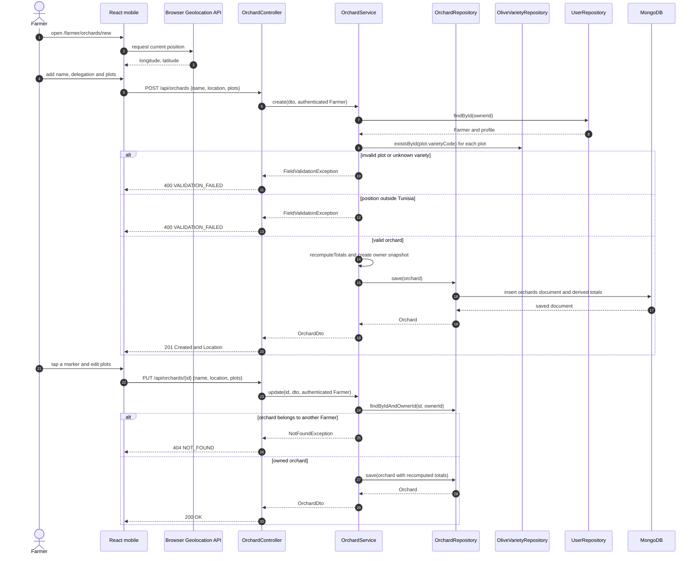
```mermaid
sequenceDiagram
    autonumber
    actor F as Farmer
    participant FE as React mobile
    participant GEO as Browser Geolocation API
    participant C as OrchardController
    participant S as OrchardService
    participant OR as OrchardRepository
    participant UVR as OliveVarietyRepository
    participant UR as UserRepository
    participant M as MongoDB
    F->>FE: open /farmer/orchards/new
    FE->>GEO: request current position
    GEO-->>FE: longitude, latitude
    F->>FE: add name, delegation and plots
    FE->>C: POST /api/orchards {name, location, plots}
    C->>S: create(dto, authenticated Farmer)
    S->>UR: findById(ownerId)
    UR-->>S: Farmer and profile
    S->>UVR: existsById(plot.varietyCode) for each plot
    alt invalid plot or unknown variety
        S-->>C: FieldValidationException
        C-->>FE: 400 VALIDATION_FAILED
    else position outside Tunisia
        S-->>C: FieldValidationException
        C-->>FE: 400 VALIDATION_FAILED
    else valid orchard
        S->>S: recomputeTotals and create owner snapshot
        S->>OR: save(orchard)
        OR->>M: insert orchards document and derived totals
        M-->>OR: saved document
        OR-->>S: Orchard
        S-->>C: OrchardDto
        C-->>FE: 201 Created and Location
    end
    F->>FE: tap a marker and edit plots
    FE->>C: PUT /api/orchards/{id} {name, location, plots}
    C->>S: update(id, dto, authenticated Farmer)
    S->>OR: findByIdAndOwnerId(id, ownerId)
    alt orchard belongs to another Farmer
        S-->>C: NotFoundException
        C-->>FE: 404 NOT_FOUND
    else owned orchard
        S->>OR: save(orchard with recomputed totals)
        OR-->>S: Orchard
        S-->>C: OrchardDto
        C-->>FE: 200 OK
    end
```

### SD-2 Declare a harvest request (F1)

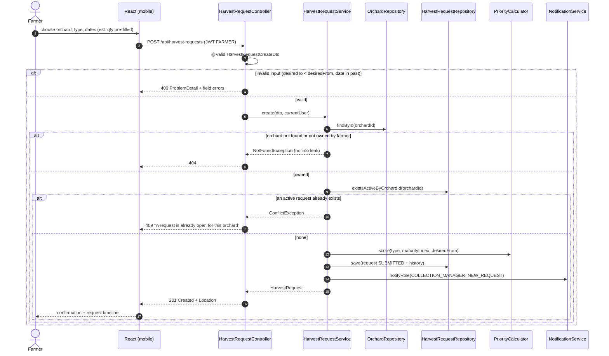
```mermaid
sequenceDiagram
    autonumber
    actor F as Farmer
    participant FE as React (mobile)
    participant C as HarvestRequestController
    participant S as HarvestRequestService
    participant OR as OrchardRepository
    participant HR as HarvestRequestRepository
    participant P as PriorityCalculator
    participant NS as NotificationService

    F->>FE: choose orchard, type, dates (est. qty pre-filled)
    FE->>C: POST /api/harvest-requests (JWT FARMER)
    C->>C: @Valid HarvestRequestCreateDto
    alt invalid input (desiredTo < desiredFrom, date in past)
        C-->>FE: 400 ProblemDetail + field errors
    else valid
        C->>S: create(dto, currentUser)
        S->>OR: findById(orchardId)
        alt orchard not found or not owned by farmer
            S-->>C: NotFoundException (no info leak)
            C-->>FE: 404
        else owned
            S->>HR: existsActiveByOrchardId(orchardId)
            alt an active request already exists
                S-->>C: ConflictException
                C-->>FE: 409 "A request is already open for this orchard"
            else none
                S->>P: score(type, maturityIndex, desiredFrom)
                S->>HR: save(request SUBMITTED + history)
                S->>NS: notifyRole(COLLECTION_MANAGER, NEW_REQUEST)
                S-->>C: HarvestRequest
                C-->>FE: 201 Created + Location
                FE-->>F: confirmation + request timeline
            end
        end
    end
```

### SD-3 Plan a collection round (F1 + F3)

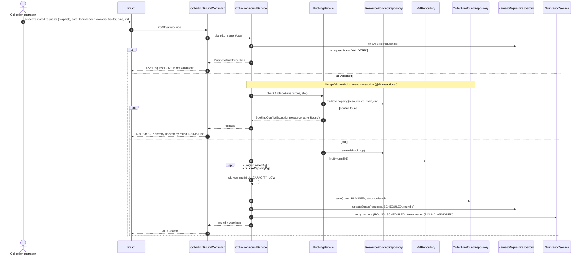
```mermaid
sequenceDiagram
    autonumber
    actor CM as Collection manager
    participant FE as React
    participant C as CollectionRoundController
    participant S as CollectionRoundService
    participant BS as BookingService
    participant BR as ResourceBookingRepository
    participant MR as MillRepository
    participant RR as CollectionRoundRepository
    participant HR as HarvestRequestRepository
    participant NS as NotificationService

    CM->>FE: select validated requests (map/list), date, team leader, workers, tractor, bins, mill
    FE->>C: POST /api/rounds
    C->>S: plan(dto, currentUser)
    S->>HR: findAllById(requestIds)
    alt a request is not VALIDATED
        S-->>C: BusinessRuleException
        C-->>FE: 422 "Request R-123 is not validated"
    else all validated
        Note over S,RR: MongoDB multi-document transaction (@Transactional)
        S->>BS: checkAndBook(resources, slot)
        BS->>BR: findOverlapping(resourceIds, start, end)
        alt conflict found
            BS-->>S: BookingConflictException(resource, otherRound)
            S-->>C: rollback
            C-->>FE: 409 "Bin B-07 already booked by round T-2026-118"
        else free
            BS->>BR: saveAll(bookings)
            S->>MR: findById(millId)
            opt sum(estimatedKg) > availableCapacityKg
                S-->>S: add warning MILL_CAPACITY_LOW
            end
            S->>RR: save(round PLANNED, stops ordered)
            S->>HR: updateStatus(requests, SCHEDULED, roundId)
            S->>NS: notify farmers (ROUND_SCHEDULED), team leader (ROUND_ASSIGNED)
            S-->>C: round + warnings
            C-->>FE: 201 Created
        end
    end
```

### SD-4 Farmer modifies / cancels a request (alternative: round already started)

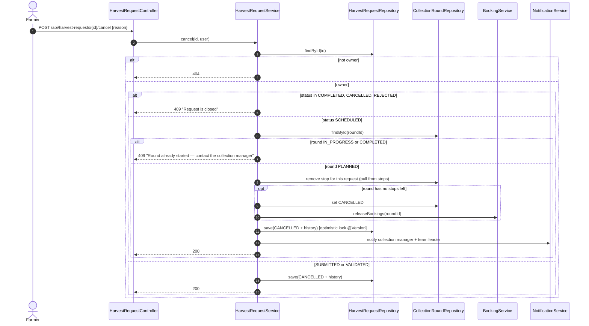
```mermaid
sequenceDiagram
    autonumber
    actor F as Farmer
    participant C as HarvestRequestController
    participant S as HarvestRequestService
    participant HR as HarvestRequestRepository
    participant RR as CollectionRoundRepository
    participant BS as BookingService
    participant NS as NotificationService

    F->>C: POST /api/harvest-requests/{id}/cancel {reason}
    C->>S: cancel(id, user)
    S->>HR: findById(id)
    alt not owner
        S-->>C: 404
    else owner
        alt status in COMPLETED, CANCELLED, REJECTED
            S-->>C: 409 "Request is closed"
        else status SCHEDULED
            S->>RR: findById(roundId)
            alt round IN_PROGRESS or COMPLETED
                S-->>C: 409 "Round already started — contact the collection manager"
            else round PLANNED
                S->>RR: remove stop for this request (pull from stops)
                opt round has no stops left
                    S->>RR: set CANCELLED
                    S->>BS: releaseBookings(roundId)
                end
                S->>HR: save(CANCELLED + history) [optimistic lock @Version]
                S->>NS: notify collection manager + team leader
                S-->>C: 200
            end
        else SUBMITTED or VALIDATED
            S->>HR: save(CANCELLED + history)
            S-->>C: 200
        end
    end
```

### SD-5 Report a field alert with geolocation (F2)

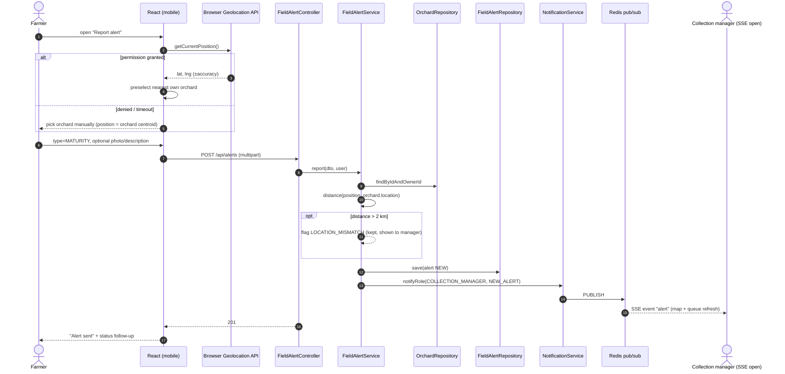
```mermaid
sequenceDiagram
    autonumber
    actor F as Farmer
    participant FE as React (mobile)
    participant GEO as Browser Geolocation API
    participant C as FieldAlertController
    participant S as FieldAlertService
    participant OR as OrchardRepository
    participant AR as FieldAlertRepository
    participant NS as NotificationService
    participant R as Redis pub/sub
    actor CM as Collection manager (SSE open)

    F->>FE: open "Report alert"
    FE->>GEO: getCurrentPosition()
    alt permission granted
        GEO-->>FE: lat, lng (±accuracy)
        FE->>FE: preselect nearest own orchard
    else denied / timeout
        FE-->>F: pick orchard manually (position = orchard centroid)
    end
    F->>FE: type=MATURITY, optional photo/description
    FE->>C: POST /api/alerts (multipart)
    C->>S: report(dto, user)
    S->>OR: findByIdAndOwnerId
    S->>S: distance(position, orchard.location)
    opt distance > 2 km
        S-->>S: flag LOCATION_MISMATCH (kept, shown to manager)
    end
    S->>AR: save(alert NEW)
    S->>NS: notifyRole(COLLECTION_MANAGER, NEW_ALERT)
    NS->>R: PUBLISH
    R-->>CM: SSE event "alert" (map + queue refresh)
    C-->>FE: 201
    FE-->>F: "Alert sent" + status follow-up
```

### SD-6 Team leader updates a round in the field (F1)

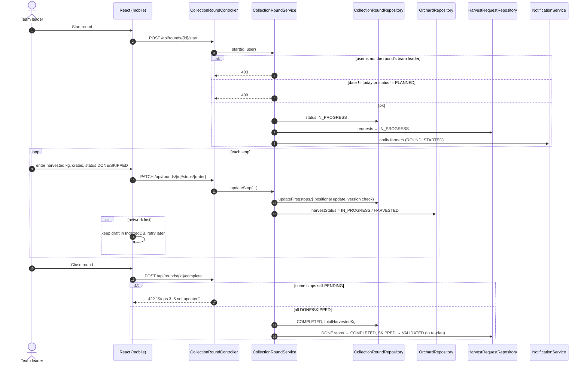
```mermaid
sequenceDiagram
    autonumber
    actor TL as Team leader
    participant FE as React (mobile)
    participant C as CollectionRoundController
    participant S as CollectionRoundService
    participant RR as CollectionRoundRepository
    participant OR as OrchardRepository
    participant HR as HarvestRequestRepository
    participant NS as NotificationService

    TL->>FE: Start round
    FE->>C: POST /api/rounds/{id}/start
    C->>S: start(id, user)
    alt user is not the round's team leader
        S-->>C: 403
    else date != today or status != PLANNED
        S-->>C: 409
    else ok
        S->>RR: status IN_PROGRESS
        S->>HR: requests → IN_PROGRESS
        S->>NS: notify farmers (ROUND_STARTED)
    end
    loop each stop
        TL->>FE: enter harvested kg, crates, status DONE/SKIPPED
        FE->>C: PATCH /api/rounds/{id}/stops/{order}
        C->>S: updateStop(...)
        S->>RR: updateFirst(stops.$ positional update, version check)
        S->>OR: harvestStatus = IN_PROGRESS / HARVESTED
        alt network lost
            FE->>FE: keep draft in IndexedDB, retry later
        end
    end
    TL->>FE: Close round
    FE->>C: POST /api/rounds/{id}/complete
    alt some stops still PENDING
        C-->>FE: 422 "Stops 3, 5 not updated"
    else all DONE/SKIPPED
        S->>RR: COMPLETED, totalHarvestedKg
        S->>HR: DONE stops → COMPLETED, SKIPPED → VALIDATED (to re-plan)
    end
```

### SD-7 Mill reception (alternative: capacity exceeded)

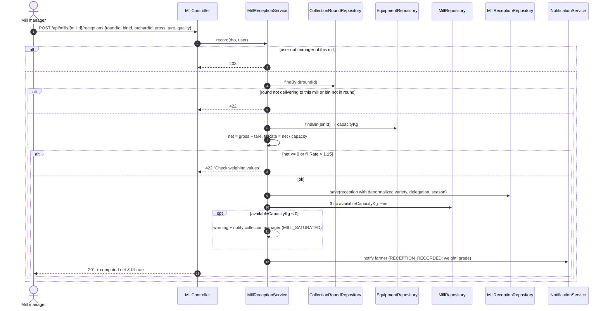
```mermaid
sequenceDiagram
    autonumber
    actor MM as Mill manager
    participant C as MillController
    participant S as MillReceptionService
    participant RR as CollectionRoundRepository
    participant ER as EquipmentRepository
    participant MR as MillRepository
    participant RCR as MillReceptionRepository
    participant NS as NotificationService

    MM->>C: POST /api/mills/{millId}/receptions {roundId, binId, orchardId, gross, tare, quality}
    C->>S: record(dto, user)
    alt user not manager of this mill
        S-->>C: 403
    else
        S->>RR: findById(roundId)
        alt round not delivering to this mill or bin not in round
            S-->>C: 422
        else
            S->>ER: findBin(binId) → capacityKg
            S->>S: net = gross − tare, fillRate = net / capacity
            alt net <= 0 or fillRate > 1.15
                S-->>C: 422 "Check weighing values"
            else ok
                S->>RCR: save(reception with denormalized variety, delegation, season)
                S->>MR: $inc availableCapacityKg: −net
                opt availableCapacityKg < 0
                    S-->>S: warning + notify collection manager (MILL_SATURATED)
                end
                S->>NS: notify farmer (RECEPTION_RECORDED: weight, grade)
                C-->>MM: 201 + computed net & fill rate
            end
        end
    end
```

### SD-8 Periodic import of external data (alternative: non-conforming rows)

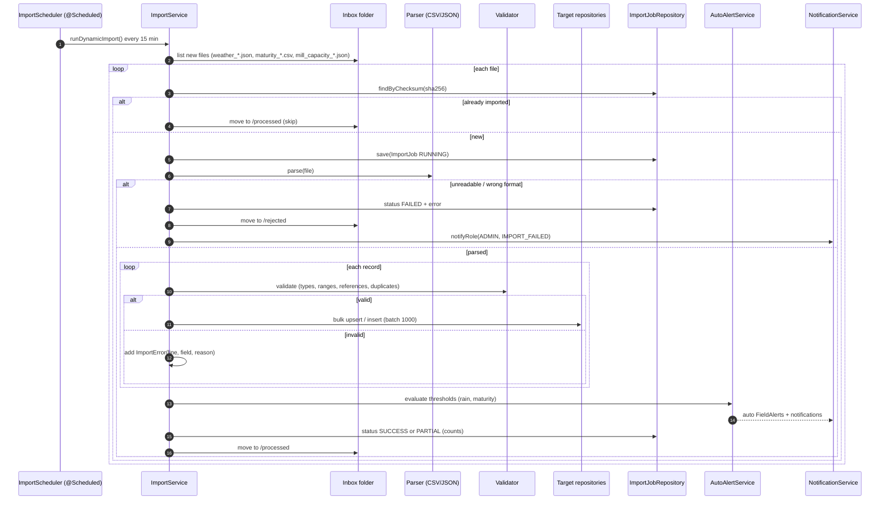
```mermaid
sequenceDiagram
    autonumber
    participant SCH as ImportScheduler (@Scheduled)
    participant IS as ImportService
    participant FS as Inbox folder
    participant P as Parser (CSV/JSON)
    participant V as Validator
    participant REPO as Target repositories
    participant JR as ImportJobRepository
    participant AA as AutoAlertService
    participant NS as NotificationService

    SCH->>IS: runDynamicImport() every 15 min
    IS->>FS: list new files (weather_*.json, maturity_*.csv, mill_capacity_*.json)
    loop each file
        IS->>JR: findByChecksum(sha256)
        alt already imported
            IS->>FS: move to /processed (skip)
        else new
            IS->>JR: save(ImportJob RUNNING)
            IS->>P: parse(file)
            alt unreadable / wrong format
                IS->>JR: status FAILED + error
                IS->>FS: move to /rejected
                IS->>NS: notifyRole(ADMIN, IMPORT_FAILED)
            else parsed
                loop each record
                    IS->>V: validate (types, ranges, references, duplicates)
                    alt valid
                        IS->>REPO: bulk upsert / insert (batch 1000)
                    else invalid
                        IS->>IS: add ImportError(line, field, reason)
                    end
                end
                IS->>AA: evaluate thresholds (rain, maturity)
                AA-->>NS: auto FieldAlerts + notifications
                IS->>JR: status SUCCESS or PARTIAL (counts)
                IS->>FS: move to /processed
            end
        end
    end
```

### SD-9 Dashboard KPI with cache (F5)

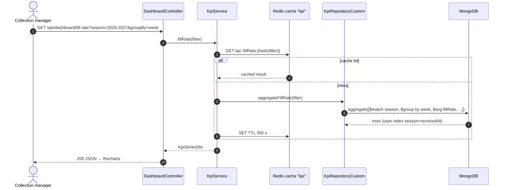
```mermaid
sequenceDiagram
    autonumber
    actor CM as Collection manager
    participant C as DashboardController
    participant K as KpiService
    participant RC as Redis cache "kpi"
    participant KR as KpiRepositoryCustom
    participant M as MongoDB

    CM->>C: GET /api/dashboard/fill-rate?season=2026-2027&groupBy=week
    C->>K: fillRate(filter)
    K->>RC: GET kpi::fillRate:{hash(filter)}
    alt cache hit
        RC-->>K: cached result
    else miss
        K->>KR: aggregateFillRate(filter)
        KR->>M: aggregate([$match season, $group by week, $avg fillRate, ...])
        M-->>KR: rows (uses index season+receivedAt)
        K->>RC: SET TTL 300 s
    end
    K-->>C: KpiSeriesDto
    C-->>CM: 200 JSON → Recharts
```

### SD-10 Admin creates, edits and disables a User (alternatives: validation, duplicate email or member number, Farmer without profile, self-lockout)

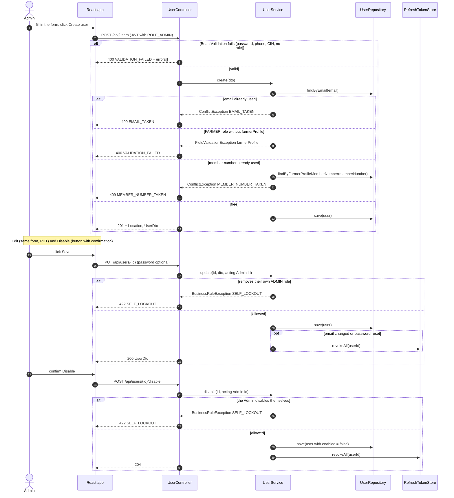
```mermaid
sequenceDiagram
    autonumber
    actor A as Admin
    participant FE as React app
    participant UC as UserController
    participant US as UserService
    participant UR as UserRepository
    participant RT as RefreshTokenStore

    A->>FE: fill in the form, click Create user
    FE->>UC: POST /api/users (JWT with ROLE_ADMIN)
    alt Bean Validation fails (password, phone, CIN, no role)
        UC-->>FE: 400 VALIDATION_FAILED + errors[]
    else valid
        UC->>US: create(dto)
        US->>UR: findByEmail(email)
        alt email already used
            US-->>UC: ConflictException EMAIL_TAKEN
            UC-->>FE: 409 EMAIL_TAKEN
        else FARMER role without farmerProfile
            US-->>UC: FieldValidationException farmerProfile
            UC-->>FE: 400 VALIDATION_FAILED
        else member number already used
            US->>UR: findByFarmerProfileMemberNumber(memberNumber)
            US-->>UC: ConflictException MEMBER_NUMBER_TAKEN
            UC-->>FE: 409 MEMBER_NUMBER_TAKEN
        else free
            US->>UR: save(user)
            UC-->>FE: 201 + Location, UserDto
        end
    end

    Note over A,FE: Edit (same form, PUT) and Disable (button with confirmation)
    A->>FE: click Save
    FE->>UC: PUT /api/users/{id} (password optional)
    UC->>US: update(id, dto, acting Admin id)
    alt removes their own ADMIN role
        US-->>UC: BusinessRuleException SELF_LOCKOUT
        UC-->>FE: 422 SELF_LOCKOUT
    else allowed
        US->>UR: save(user)
        opt email changed or password reset
            US->>RT: revokeAll(userId)
        end
        UC-->>FE: 200 UserDto
    end

    A->>FE: confirm Disable
    FE->>UC: POST /api/users/{id}/disable
    UC->>US: disable(id, acting Admin id)
    alt the Admin disables themselves
        US-->>UC: BusinessRuleException SELF_LOCKOUT
        UC-->>FE: 422 SELF_LOCKOUT
    else allowed
        US->>UR: save(user with enabled = false)
        US->>RT: revokeAll(userId)
        UC-->>FE: 204
    end
```

## 3. State machines

### HarvestRequest

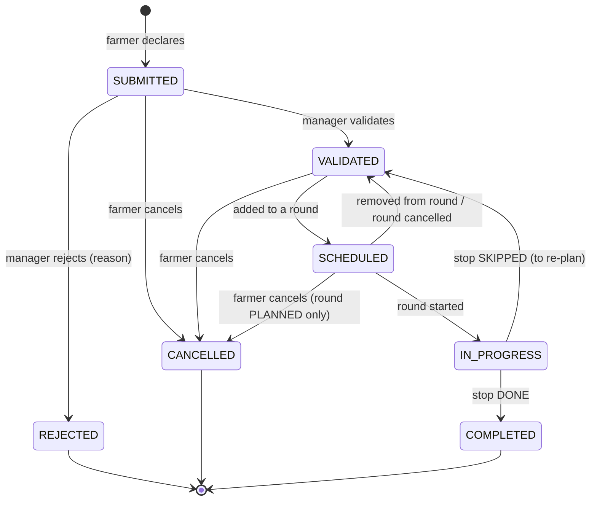
```mermaid
stateDiagram-v2
    [*] --> SUBMITTED : farmer declares
    SUBMITTED --> VALIDATED : manager validates
    SUBMITTED --> REJECTED : manager rejects (reason)
    SUBMITTED --> CANCELLED : farmer cancels
    VALIDATED --> SCHEDULED : added to a round
    VALIDATED --> CANCELLED : farmer cancels
    SCHEDULED --> VALIDATED : removed from round / round cancelled
    SCHEDULED --> CANCELLED : farmer cancels (round PLANNED only)
    SCHEDULED --> IN_PROGRESS : round started
    IN_PROGRESS --> COMPLETED : stop DONE
    IN_PROGRESS --> VALIDATED : stop SKIPPED (to re-plan)
    REJECTED --> [*]
    CANCELLED --> [*]
    COMPLETED --> [*]
```

Farmer may modify the request only in `SUBMITTED`, `VALIDATED`, or `SCHEDULED` with the round still `PLANNED`. A change to the dates of a `SCHEDULED` request moves it back to `VALIDATED`, which removes it from its round.

### CollectionRound

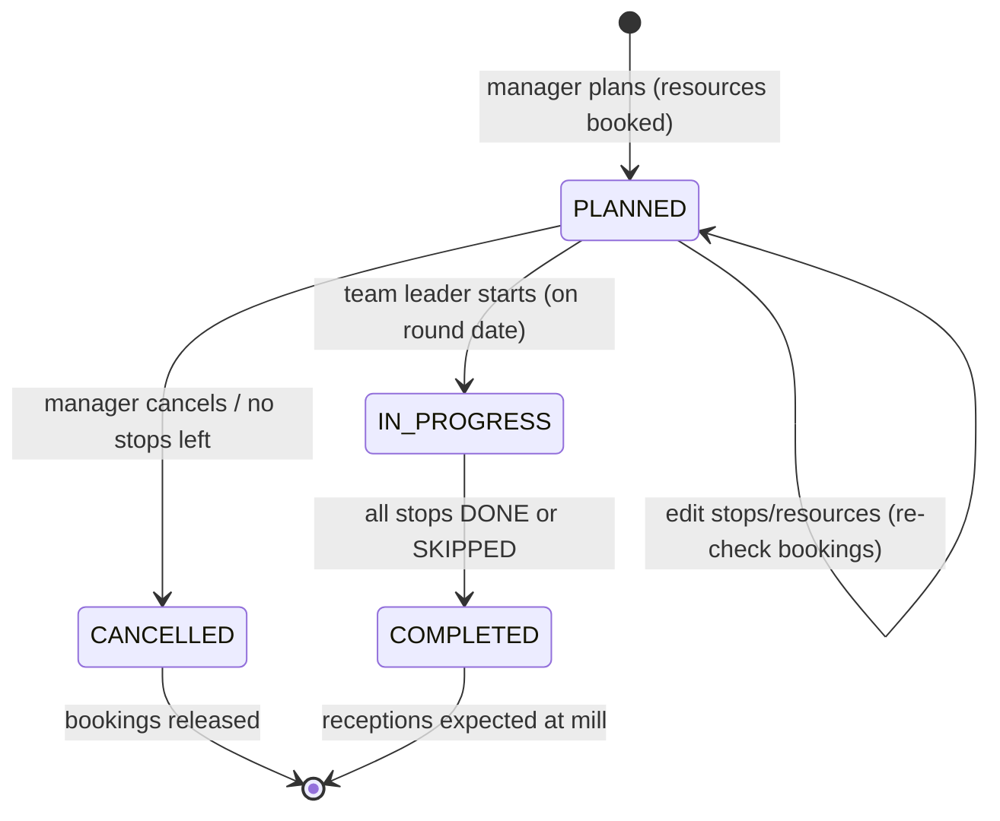
```mermaid
stateDiagram-v2
    [*] --> PLANNED : manager plans (resources booked)
    PLANNED --> PLANNED : edit stops/resources (re-check bookings)
    PLANNED --> CANCELLED : manager cancels / no stops left
    PLANNED --> IN_PROGRESS : team leader starts (on round date)
    IN_PROGRESS --> COMPLETED : all stops DONE or SKIPPED
    CANCELLED --> [*] : bookings released
    COMPLETED --> [*] : receptions expected at mill
```

### RoundStop

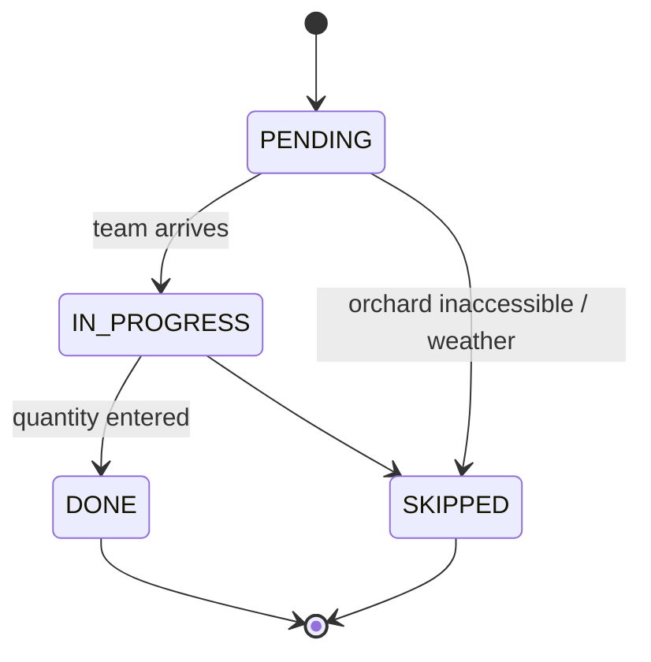
```mermaid
stateDiagram-v2
    [*] --> PENDING
    PENDING --> IN_PROGRESS : team arrives
    IN_PROGRESS --> DONE : quantity entered
    PENDING --> SKIPPED : orchard inaccessible / weather
    IN_PROGRESS --> SKIPPED
    DONE --> [*]
    SKIPPED --> [*]
```

### FieldAlert

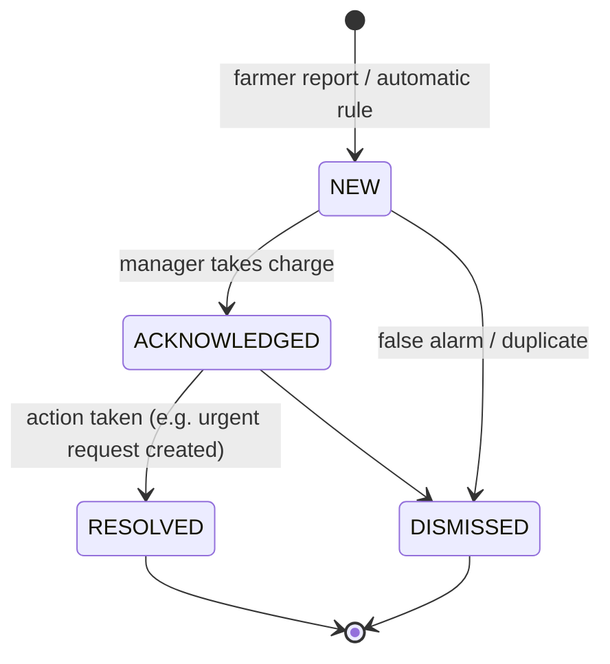
```mermaid
stateDiagram-v2
    [*] --> NEW : farmer report / automatic rule
    NEW --> ACKNOWLEDGED : manager takes charge
    NEW --> DISMISSED : false alarm / duplicate
    ACKNOWLEDGED --> RESOLVED : action taken (e.g. urgent request created)
    ACKNOWLEDGED --> DISMISSED
    RESOLVED --> [*]
    DISMISSED --> [*]
```

### Equipment

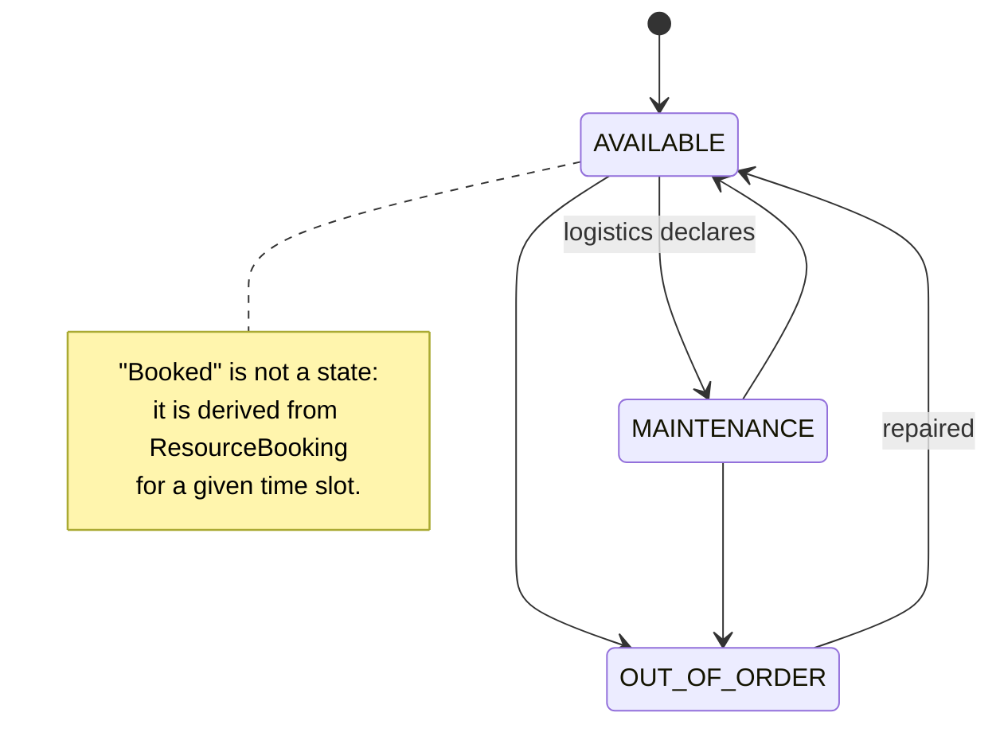
```mermaid
stateDiagram-v2
    [*] --> AVAILABLE
    AVAILABLE --> MAINTENANCE : logistics declares
    MAINTENANCE --> AVAILABLE
    AVAILABLE --> OUT_OF_ORDER
    MAINTENANCE --> OUT_OF_ORDER
    OUT_OF_ORDER --> AVAILABLE : repaired
    note right of AVAILABLE
        "Booked" is not a state:
        it is derived from ResourceBooking
        for a given time slot.
    end note
```

## 4. Activity diagram — global collection process

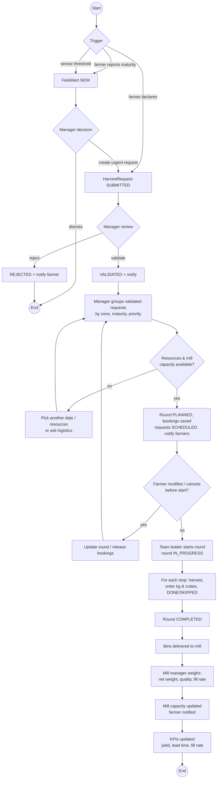
```mermaid
flowchart TD
    start((Start)) --> A{Trigger}
    A -- farmer declares --> B[HarvestRequest SUBMITTED]
    A -- farmer reports maturity --> AL[FieldAlert NEW]
    A -- sensor threshold --> AL
    AL --> AL2{Manager decision}
    AL2 -- dismiss --> endA((End))
    AL2 -- create urgent request --> B
    B --> C{Manager review}
    C -- reject --> R[REJECTED + notify farmer] --> endA
    C -- validate --> D[VALIDATED + notify]
    D --> E[Manager groups validated requests<br/>by zone, maturity, priority]
    E --> F{Resources & mill<br/>capacity available?}
    F -- no --> G[Pick another date / resources<br/>or ask logistics] --> E
    F -- yes --> H[Round PLANNED, bookings saved<br/>requests SCHEDULED, notify farmers]
    H --> I{Farmer modifies / cancels<br/>before start?}
    I -- yes --> J[Update round / release bookings] --> E
    I -- no --> K[Team leader starts round<br/>round IN_PROGRESS]
    K --> L[For each stop: harvest,<br/>enter kg & crates, DONE/SKIPPED]
    L --> M[Round COMPLETED]
    M --> N[Bins delivered to mill]
    N --> O[Mill manager weighs:<br/>net weight, quality, fill rate]
    O --> P[Mill capacity updated<br/>farmer notified]
    P --> Q[KPIs updated<br/>yield, lead time, fill rate]
    Q --> endB((End))
```

## 5. Planning helper (PlanningService)

The subject asks to plan "according to orchard maturity and resource availability". The manager stays in charge, and the system only **suggests**:

1. **Priority score** of each validated request:
   `score = 40·[URGENT] + 30·maturityProximity + 20·min(waitingDays/7, 1) + 10·[open MATURITY alert]`
   where `maturityProximity = 1 − |index − optimalMid| / optimalHalfWidth` (clamped to 0..1, from `OliveVariety`).
2. **Grouping suggestion**: for a chosen date, take requests sorted by score. Seed a round with the top one, then add the nearest requests (`$geoNear` from the seed orchard, within 10 km) until the estimated kg reach the sum of the booked bin capacities.
3. **Availability**: list the workers and equipment with no overlapping `ResourceBooking`, no `Unavailability`, and status `AVAILABLE`.
4. **Mill choice**: pick the nearest mill whose `availableCapacityKg` covers the estimate, using a `$geoNear` query on `mills`.

The `GET /api/planning/suggestions?date=` endpoint returns these suggestions. Creating the round still goes through SD-3.
